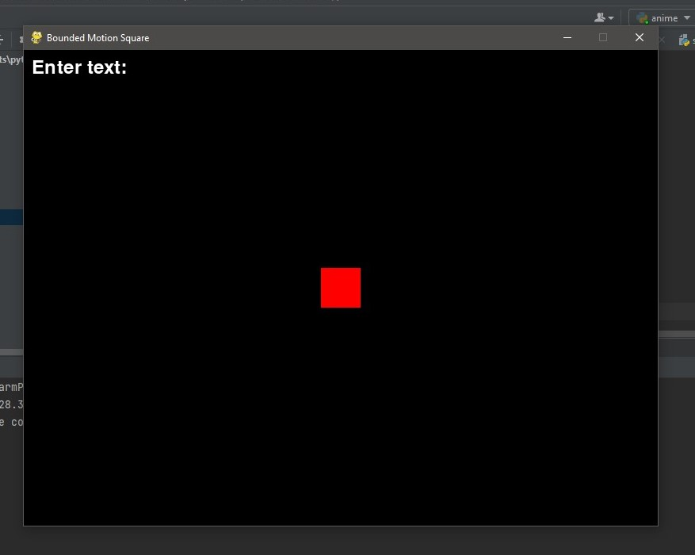
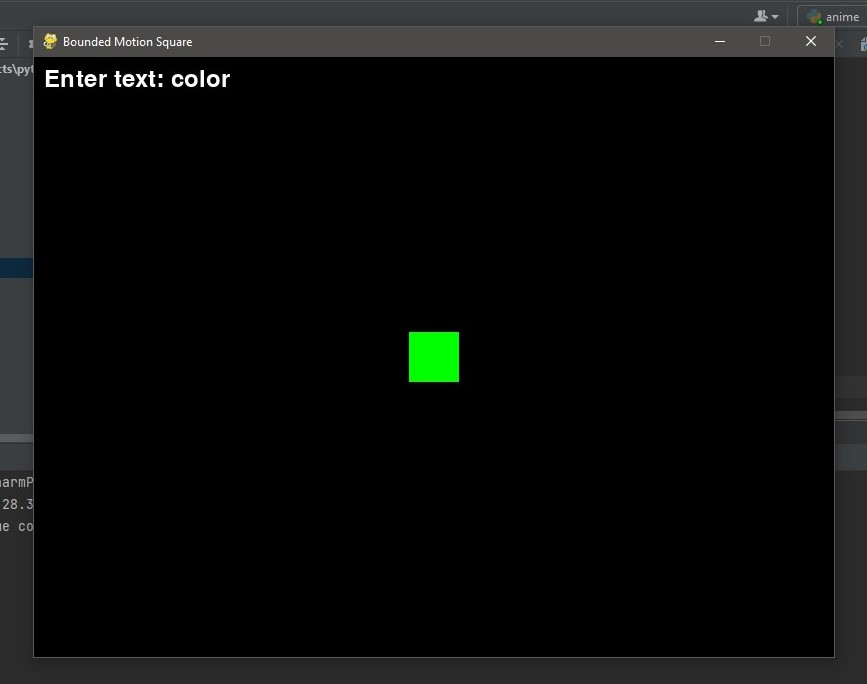
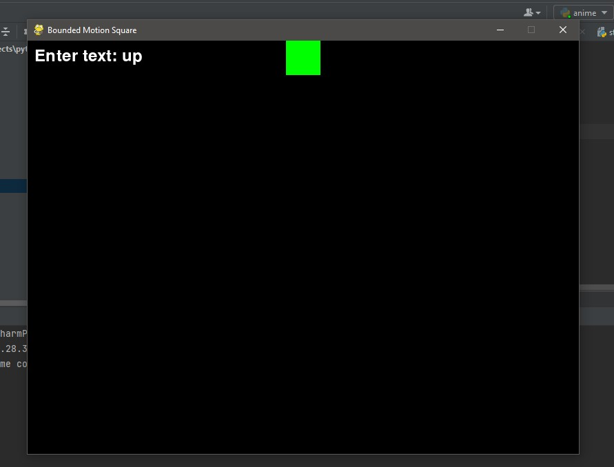
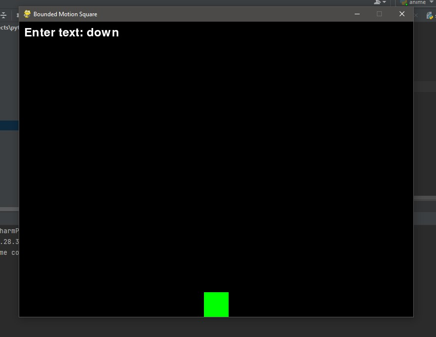
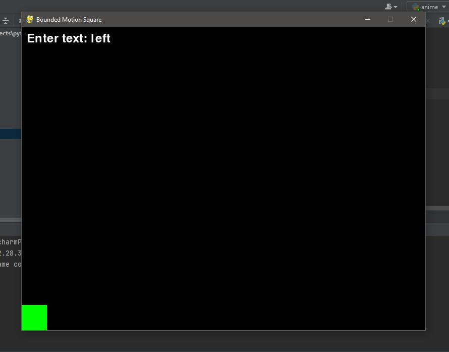
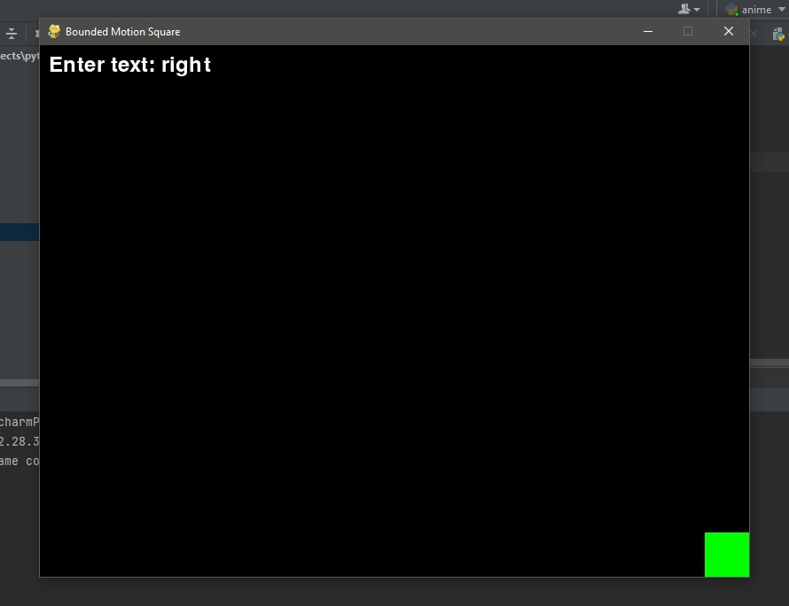

# Project Scope Document: Educational Concept Animation
## Step 1:
I've built a model that gets the command as the input text and a square in considered to do the respective animations..
### code:
```py
import pygame
import sys

pygame.init()

width, height = 800, 600
screen = pygame.display.set_mode((width, height))
pygame.display.set_caption("Bounded Motion Square")

black = (0, 0, 0)
white = (255, 255, 255)
red = (255, 0, 0)
green = (0, 255, 0)
blue = (0, 0, 255)

clock = pygame.time.Clock()

class BoundedMotionSquare:
    def __init__(self, x, y, size, color):
        self.rect = pygame.Rect(x, y, size, size)
        self.color = color
        self.rotation_angle = 0
        self.speed = 5  # Adjust the speed as needed
        self.direction = (0, 0)

    def rotate(self):
        self.rotation_angle += 5
        if self.rotation_angle >= 360:
            self.rotation_angle = 0

    def change_color(self):
        colors = [red, green, blue]
        current_index = colors.index(self.color)
        next_index = (current_index + 1) % len(colors)
        self.color = colors[next_index]

    def update(self, command):
        if command == "up":
            self.direction = (0, -1)
        elif command == "down":
            self.direction = (0, 1)
        elif command == "left":
            self.direction = (-1, 0)
        elif command == "right":
            self.direction = (1, 0)
        elif command == "rotate":
            self.rotate()
        elif command == "color":
            self.change_color()

    def move(self):
        self.rect.x += self.direction[0] * self.speed
        self.rect.y += self.direction[1] * self.speed

        # Boundary checks to stay within the screen
        self.rect.x = max(0, min(self.rect.x, width - self.rect.width))
        self.rect.y = max(0, min(self.rect.y, height - self.rect.height))

    def draw(self):
        pygame.draw.rect(screen, self.color, self.rect)
        rotated_square = pygame.transform.rotate(pygame.Surface(self.rect.size, pygame.SRCALPHA), self.rotation_angle)
        rotated_rect = rotated_square.get_rect(center=self.rect.center)
        screen.blit(rotated_square, rotated_rect.topleft)

# Create an instance of the BoundedMotionSquare
initial_x = width // 2 - 25  # Adjust as needed
initial_y = height // 2 - 25  # Adjust as needed
bounded_motion_square = BoundedMotionSquare(initial_x, initial_y, 50, red)

# Initialize the text input
pygame.font.init()
font = pygame.font.Font(None, 36)
input_text = ""

while True:
    for event in pygame.event.get():
        if event.type == pygame.QUIT:
            pygame.quit()
            sys.exit()

        # Handle text input events
        if event.type == pygame.KEYDOWN:
            if event.key == pygame.K_RETURN:
                bounded_motion_square.update(input_text.lower())
                input_text = ""
            elif event.key == pygame.K_BACKSPACE:
                input_text = input_text[:-1]
            else:
                input_text += event.unicode

    bounded_motion_square.move()

    screen.fill(black)
    bounded_motion_square.draw()

    # Display the text input
    input_surface = font.render("Enter text: " + input_text, True, white)
    screen.blit(input_surface, (10, 10))

    pygame.display.flip()

    clock.tick(60)
```
### output:
### initial screen:


### Giving the command: color


### Giving the command: up


### Giving the command: down


### Giving the command: left


### Giving the command: right


## Conclusion:
This code is just a initialization of the Educational Content to Animation model.I'm very eager to imporve the code to the next level of the imagination.Stay tuned....
